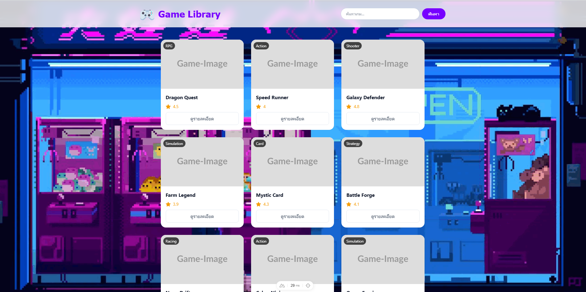

# 🎮 Game Library (Nuxt 3 + Tailwind CSS)

โปรเจกต์เว็บสำหรับแสดงรายการเกม พร้อมระบบค้นหา และหน้าต่าง Popup รายละเอียด  
สร้างด้วย **Nuxt 3 + Vue 3 Composition API + TailwindCSS**  
รองรับ API จริงจาก https://fe-test-api.midassoft.dev

---

## 🚀 ฟีเจอร์หลัก

### ✅ แสดงรายการเกมทั้งหมด
- โหลดข้อมูลจาก API:  
  `POST https://fe-test-api.midassoft.dev/api/games`
- แสดงรูปเกม ชื่อเกม หมวดหมู่ และคะแนน

### 🔍 ระบบค้นหาเกม
- ค้นหาด้วย API:  
  `POST https://fe-test-api.midassoft.dev/api/search?query=xxx`
- ผู้ใช้สามารถค้นหาจากชื่อเกมได้ทันที
- รองรับกด Enter หรือปุ่ม "ค้นหา"

### 🪟 Popup Modal (ดูรายละเอียดเกม)
- กดปุ่ม "ดูรายละเอียด" เพื่อเปิด pop-up
- แสดงรูปเกมใหญ่ + title + category + rating
- ปิด popup ได้ด้วยปุ่ม ✕

### 🎨 UI พร้อมใช้งาน
- Navbar สวยแบบ glassmorphism (`backdrop-blur`)
- Card เกมแบบ modern + hover effect
- รองรับมือถือ (Responsive) 100%

---

## 📁 โครงสร้างโปรเจกต์

game-project/
│
├── components/
│ └── Home/
│ └── index.vue # หน้าแสดงเกม + Search + Modal
│
├── pages/
│ └── index.vue # เรียก HomeIndex (auto-import)
│
├── assets/
│ └── css/
│ └── tailwind.css # ไฟล์ tailwind global
│
├── public/
│ └── bg.jpg # รูปพื้นหลัง (optional)
│
├── nuxt.config.ts # ตั้งค่า global css
└── README.md


---

## 🛠️ การติดตั้งและเริ่มใช้งาน

### 1️⃣ ติดตั้ง dependencies

```bash
npm install
2️⃣ รันเซิร์ฟเวอร์
npm run dev


เว็บจะเปิดที่:
➡ http://localhost:3000

📸 UI Preview


🤝 ผู้จัดทำ

Created by [Achiraya Komatsu]
Frontend Developer — Nuxt 3 / Vue 3 / TailwindCSS

